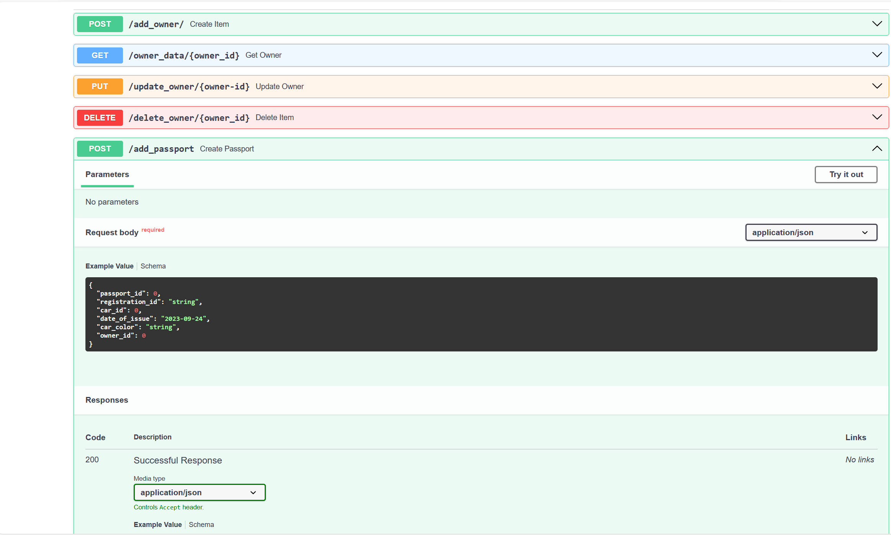

# База данных для учета автомобилей и их владельцев

Чтобы установить проект, выполните следующие шаги:

1. Скопируйте репозиторий: "git clone https://github.com/Baiken2016/task_test.git"
2. Установите библиотеку fastapi: 'pip install fastapi'
3. Установите библиотеку alembic: 'pip install alembic'
4. Установите библиотеку sqlalchemy: 'pip install SQLAlchemy'
5. Установите библиотеку pydantic: 'pip install pydantic'
6. Установите библиотеку uvicorn: 'pip install uvicorn'
7. В вашей СУБД (postgresql) создайте локальную базу данных
8. В репозитории создайте файл "config.py" и внесите туда
   данные вашей локальной базы данных:
    1. DB_NAME: имя базы данных
    2. DB_PASSWORD: пароль бд
    3. DB_USERNAME: имя пользователя бд
    4. DB_HOST: xост бд (localhost по дефолту)
9. Для запуска приложения введите команду: 'uvicorn main:app --reload'

Интерактивная документация по API
