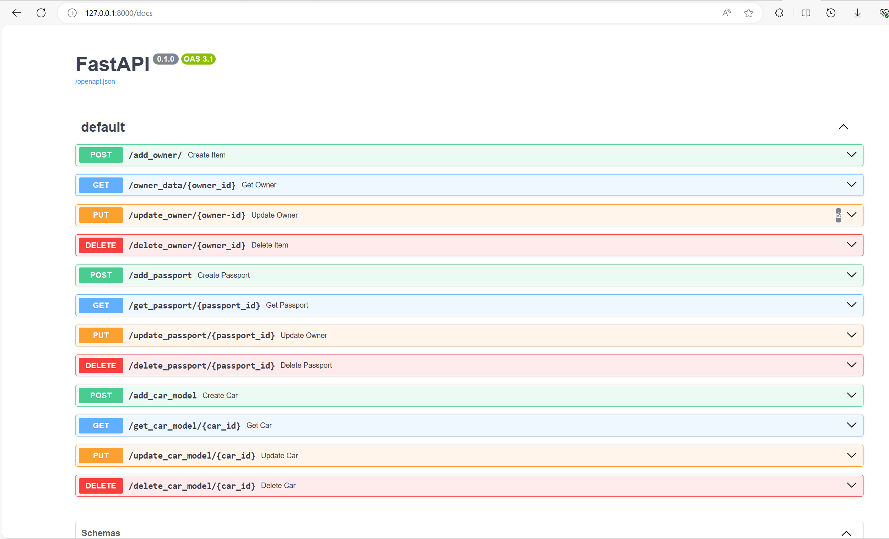

# База данных для учета автомобилей и их владельцев

Чтобы установить проект, выполните следующие шаги:

1. Скопируйте репозиторий: "git clone https://github.com/Baiken2016/task_test.git"
2. Установите зависимости из корнейвой директории: "pip install -r requirements"
3. В вашей СУБД (postgresql) создайте локальную базу данных
4. В корневой директории в файле ".env" внесите данные вашей локальной базы данных:
    1. DB_NAME: имя базы данных
    2. DB_PASSWORD: пароль бд
    3. DB_USERNAME: имя пользователя бд
    4. DB_HOST: xост бд (localhost по дефолту)
   5. DB_PORT: порт бд (5432 по дефолту)
5. Для запуска приложения перейдите в директорию src и введите команду: 'uvicorn main:app --reload'
6. Для просмотра документации в пути .\docs\build\html откройте файл index.html в браузере
7. Для создания или обновления документации в директории .\docs введите команду .\make.bat html
Интерактивная документация по API
